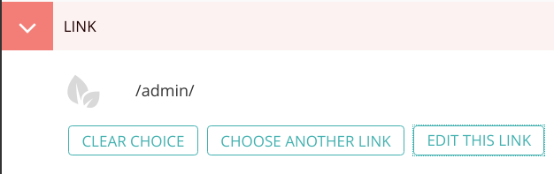

# wagtail-links

## Purpose

Wagtail links has two goals:

- Provide a consistent way to refer to links, which may be of different types, so as to reduce decision fatigue
- Minimize broken links as much as possible.


## Install

Install wagtail-links via Pip.

```sh
pip install wagtail-links
```

Add `wagtail_links` to your Django project's `INSTALLED_APPS` setting.

Run database migrations.

```sh
python manage.py migrate
```


## Usage

Add a foreign key to the page you wish to add links to.

```py
my_link = models.ForeignKey(
    'wagtail_links.Link',
    null=True,
    blank=True,
    on_delete=models.SET_NULL,
    related_name='+'
)
```

Neat:



You may use it like:

```html
<a href="{{ self.link.url }}">Link here</a>
```

From a template, you can also load a link by its name:

```html


<a href="">Link here</a>
```

This is useful for global page links, navigation, etc.


## Searching links

Every field on a `Link` is searchable, both in the Snippets area and in the
link choosers: `title`, `name`, `link_external`, `link_relative`,
`django_view_name`, and the linked page's title. Each field is indexed as both
a full-text `SearchField` and an `AutocompleteField` (type-ahead).

The resolved URL is also indexed via the `search_url` property, which replaces
separators with spaces so full-text backends can match individual host/path
segments (e.g. `2022` in `.../2022/...`) — something they can't do against a
raw URL, which Postgres indexes as one opaque token.

Upgrading from an earlier version re-indexes existing links automatically via a
migration, so no manual `python manage.py update_index` is needed.


## Validation and logging

The Link model will validate that one and only one field is set.
It will also disallow invalid Django reverse view names.

If a URL cannot be determined, we'll log the issue as a warning. We won't throw an exception as that would be bad for users. You are responsible for capturing this log warning, perhaps using Sentry.

For example - let's say you make a Django view name called admin:index. This would typically give you `/admin/`. Later the admin application is removed from the program, now this link fails. It will now display "" and generate a warning in your server logs.
